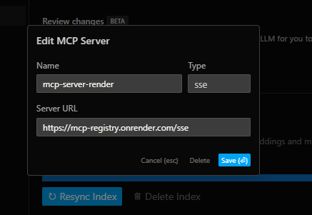
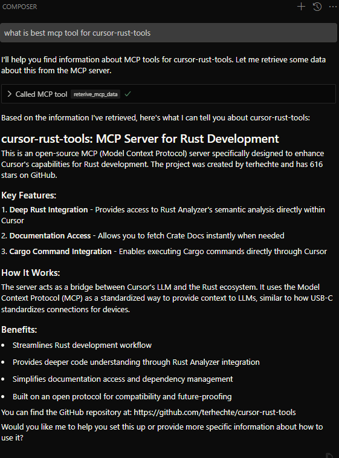
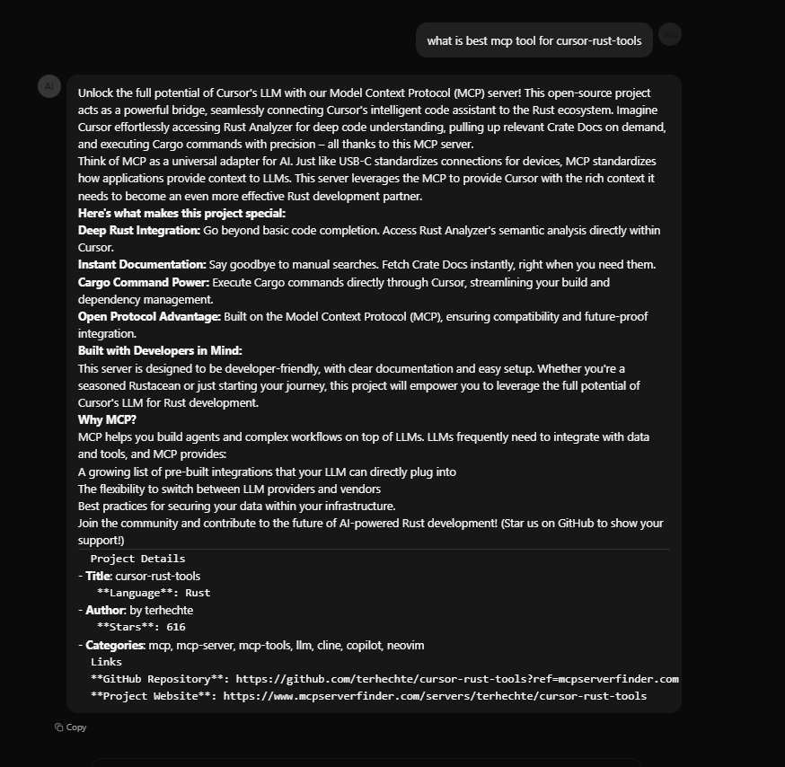

# MCP SSE Server

A Python backend implementation of the Model Context Protocol (MCP) using Server-Sent Events (SSE) for real-time communication with LLMs.

## 📝 Overview

This project implements an MCP server that provides tools for LLMs (Large Language Models) to interact with external data sources and execute operations. It uses SSE (Server-Sent Events) as the transport layer, allowing for real-time communication between clients and the server.

The server integrates with:
- **Vector Store**: For semantic search and retrieval using Pinecone
- **LLM APIs**: Google Gemini and Groq for content generation and embeddings
- **Self-Query Retrieval**: Enabling natural language queries against structured data

## ✨ Features

- **SSE Transport Layer**: Long-lived connections for real-time communication
- **Vectorized Document Storage**: Using Pinecone for efficient semantic search
- **MCP Tool Integration**: Define and expose tools that LLMs can call
- **LLM Integration**: Access to Google Gemini and Groq models
- **RESTful Endpoints**: For querying and data retrieval
- **Web Scraping Utilities**: For gathering MCP tool information

## 🌐 Deployed Instances

You can access the deployed version of this MCP server in two ways:

1. **Direct SSE Connection**:  
   Connect to the SSE endpoint at:
   ```
   https://mcp-registry.onrender.com/sse
   ```



   
2. **Web Chat Interface**:  
   Use the web-based chat interface at:
   ```
   https://mcpserver.cognitodev.space/
   ```



> **Note**: Since the server is deployed on Render's free tier, it may occasionally shut down due to inactivity. If you experience connection issues, please try again after a few minutes while the server spins up.

## 🔧 Project Structure

```
.
├── config/                     # Configuration files
│   ├── __init__.py             # Core config variables and constants
│   ├── google_gemini.py        # Google Gemini API client
│   └── groq_client.py          # Groq API client
├── llm/
│   └── self_query.py           # Self-query retrieval implementation
├── mcp_manage/                 # MCP protocol management
│   ├── clients/
│   │   └── client_sse.py       # SSE client implementation
│   └── servers/
│       └── sse_server/
│           └── terminal_server_sse.py # Main SSE server implementation
├── utils/
│   ├── docs_text_splitter.py   # Text splitting utilities
│   └── enhance_mcp.py          # Description enhancement using LLMs
├── vector_store/               # Vector store components
│   ├── _load_documents.py      # Document loading and processing
│   ├── config.py               # Pinecone configuration
│   ├── manage_vector_store.py  # Vector store management
│   └── metadata_structure_info.py # Metadata structure definition
├── website_scraper/            # Web scraping utilities
│   ├── mcp_scraper.py          # MCP server registry scraper
│   └── tools_scraper.py        # MCP tools details scraper
├── main.py                     # Application entry point
└── requirements.txt            # Project dependencies
```

## 🚀 Setup Instructions

### Prerequisites

- Python 3.8+
- Pinecone account (for vector storage)
- Google Gemini API key
- Groq API key

### Installation

1. Clone the repository:
   ```bash
   git clone <repository-url>
   cd mcp-sse-server
   ```

2. Install dependencies:
   ```bash
   pip install -r requirements.txt
   ```

3. Create a `.env` file in the root directory with your API keys:
   ```
   GEMINI_API_KEY=your_gemini_api_key
   GROQ_API_KEY=your_groq_api_key
   PINECONE_API_KEY=your_pinecone_api_key
   ```

4. Create a workspace directory (used by the `run_command` tool):
   ```bash
   mkdir -p ~/mcp/workspace
   ```

## 📊 Usage

### Starting the Server

Run the MCP SSE server using:

```bash
python main.py
```

The server will start on port 8000 by default and expose the following endpoints:
- `/sse`: For SSE connections
- `/messages/`: For POST-based message communication
- `/rag_query`: For RAG (Retrieval-Augmented Generation) queries

### Connecting with a Client

You can use the included client implementation to connect to the server:

```bash
python -m mcp_manage.clients.client_sse http://localhost:8000/sse
```

This will start an interactive chat session where you can query the MCP server.

### Available Tools

The MCP server exposes the following tools:

1. **run_command**: Execute shell commands in the workspace directory
2. **add_numbers**: Simple tool that adds two numbers
3. **reterive_mcp_data**: Query the vector store for relevant MCP tool information

### Vector Store Population

To populate the vector store with MCP tool information:

1. Scrape MCP tool information:
   ```bash
   python -m website_scraper.mcp_scraper
   ```

2. Enhance MCP descriptions using LLMs:
   ```bash
   python -m utils.enhance_mcp
   ```

3. Load documents into the vector store:
   ```python
   from vector_store._load_documents import create_vector_store_document
   from vector_store.manage_vector_store import PineconeVectorStoreManage
   from config.google_gemini import LangchainGeminiClient

   embeddings = LangchainGeminiClient().generate_embeddings()
   documents = create_vector_store_document()
   vector_store = PineconeVectorStoreManage()
   vector_store.create_documents(documents=documents, embeddings=embeddings)
   ```

## 📘 Model Context Protocol (MCP)

MCP is an open protocol that standardizes how applications provide context to LLMs. It's designed to be a universal connection layer (like "USB-C for AI") allowing LLMs to interact with various data sources and tools.

### Why MCP?

- **Standardization**: Provides a consistent way to connect AI models with external systems
- **Interoperability**: Enables switching between different LLM providers
- **Security**: Best practices for securing data within your infrastructure
- **Extensibility**: Growing ecosystem of pre-built integrations

## 🔄 Development and Extending

### Adding New Tools

To add a new tool to the MCP server, add a new function to the `terminal_server_sse.py` file with the `@mcp.tool()` decorator:

```python
@mcp.tool()
async def my_new_tool(param1: str, param2: int) -> str:
    """
    Documentation for your tool.
    
    Args:
        param1 (str): Description of param1
        param2 (int): Description of param2
        
    Returns:
        str: Description of return value
    """
    # Your tool implementation
    return result
```

## 📜 License

[MIT License](LICENSE)

## 🙏 Acknowledgments

- [MCP Protocol](https://github.com/mcp-sh/mcp) - For the Model Context Protocol specification
- [Pinecone](https://www.pinecone.io/) - For vector search functionality
- [Google Gemini](https://ai.google.dev/) - For AI model integration
- [Groq](https://groq.com/) - For AI model integration
- [theailanguage](https://www.youtube.com/watch?v=s0YJNcT1XMA&t=2414s) - SSE server code using GEMINI API
- [Render](https://.render.com) - Deploy Free hosting
- [Vercel](https://vercel.com/) - ChatApplication hosting